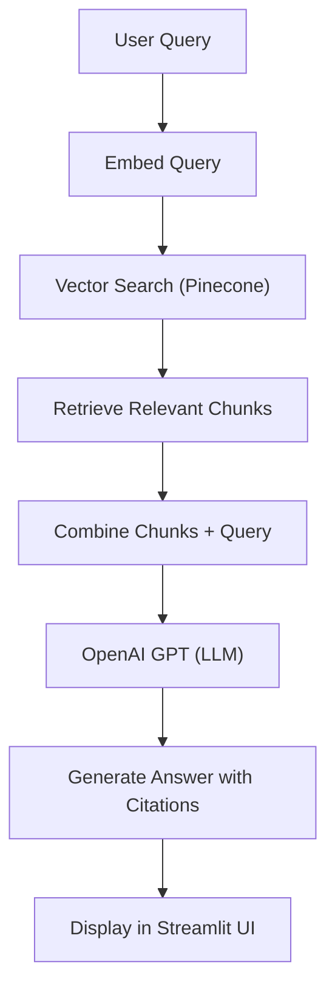

# 🏥 Medical Knowledge Chatbot (RAG-based)

A GenAI-powered chatbot that leverages Retrieval-Augmented Generation (RAG) to answer medical questions using information from PDF documents. Built with LangChain, OpenAI GPT, HuggingFace embeddings, and Pinecone vector database.

---

## 🚀 Architecture Overview



- **Document Ingestion:** PDFs are split into chunks, embedded using HuggingFace models, and stored in Pinecone.
- **Retrieval:** User queries are embedded and matched against the vector store to fetch relevant context.
- **Generation:** Retrieved context + user query are sent to OpenAI GPT to generate a grounded, cited answer.
- **UI:** Streamlit app for real-time Q&A with source/page references.

---

## ✨ Features

- **RAG Pipeline:** Combines retrieval and generation for accurate, context-aware answers.
- **Source Attribution:** Every answer includes page-level citations for transparency.
- **Fast Semantic Search:** Pinecone vector DB enables rapid, scalable retrieval.
- **Customizable:** Easily swap models, chunk sizes, or add new documents.
- **Modern UI:** Streamlit interface for interactive chat and index management.

---

## 🛠️ How It Works

1. **Index Creation:**  
   - PDFs are processed, chunked, and embedded.
   - Embeddings are stored in Pinecone as a vector index.

2. **Chat Flow:**  
   - User asks a question in the Streamlit app.
   - The system retrieves the most relevant document chunks.
   - The question + retrieved context are sent to OpenAI GPT.
   - The answer, with citations, is displayed to the user.

---

## 📦 Installation & Usage

### 1. Clone the Repository

```bash
git clone https://github.com/YourUsername/Custom-Medical-Dataset-Chatbot.git
cd Custom-Medical-Dataset-Chatbot
```

### 2. Install Dependencies

```bash
pip install -r requirements.txt
```

### 3. Set Up API Keys

- Create a `.env` file in the root directory:
  ```
  PINECONE_API_KEY=your_pinecone_api_key
  OPENAI_API_KEY=your_openai_api_key
  ```
- Or, for Streamlit Cloud, add them to `.streamlit/secrets.toml`.

### 4. Add Your Medical PDFs

- Place your PDF files in the project root directory.

### 5. Run the Application

```bash
# Option 1: Let the app handle index creation
streamlit run streamlit_app.py

# Option 2: Manually create the index first
python create_index.py
streamlit run streamlit_app.py
```

---

## 🖼️ Screenshots

<!-- Add screenshots of your UI here if available -->
<!--  -->

---

## 🤖 Tech Stack

- **LangChain** (RAG pipeline)
- **OpenAI GPT** (LLM)
- **HuggingFace Transformers** (Embeddings)
- **Pinecone** (Vector DB)
- **Streamlit** (UI)
- **Python**

---

## 📄 License

MIT License

---

## 🙋‍♂️ Contact

For questions or collaboration, reach out via [LinkedIn](https://www.linkedin.com/in/shubhammahobia/) or open an issue!
